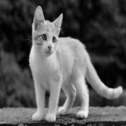

# image-filter-starter-code
Project 2

Testing the image through the filter, we use this URL in postman,

http://localhost:8082/filteredimage?image_url=https://upload.wikimedia.org/wikipedia/commons/b/bd/Golden_tabby_and_white_kitten_n01.jpg

IMAGE BEFORE THE FILTERING

IMAGE AFTER FILTERING

AWS ELASTIC BEANSTALK

http://udagram-ruttner-dev.us-east-2.elasticbeanstalk.com

http://udagram-ruttner-dev.us-east-2.elasticbeanstalk.com/filteredimage?image_url=https://upload.wikimedia.org/wikipedia/commons/b/bd/Golden_tabby_and_white_kitten_n01.jpg

*NOTE*
The original code for util.ts had an error output, *saying could not find MIME BUFFER <NULL>*, but from the slack community for ALX-T Cloud developer, @Ismail El Bouhi posted a solution to that error, which I then changed the orignal code.

